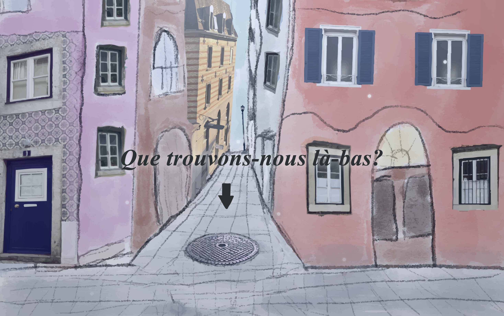

<!-- Titelbild -->

  

# Que trouvons-nous là-bas?
### Interaktive Medien – Scrollytelling (2025)

**Maria Reichmuth, Ricarda Schirato (MMP23CV)**

**Artefakt:** projektim05.mariareichmuth  
**Praesentationsvideo:** [Link einfügen]

---

## Abstract
Das interaktive Scrollytelling *Que trouvons-nous là-bas?* untersucht innere Konflikte des Menschen anhand einer urbanen Metapher: dem Gullideckel als Grenze zwischen Oberfläche und Untergrund.

Durch Scroll-Interaktion wird der Blick von einer lebendigen Stadtoberfläche in einen dunklen Raum gelenkt, der verdrängte Gedanken und Emotionen symbolisiert. Fotografie, Illustration, Animation, Typografie und Scrollbewegung werden zu einer linearen, immersiven Erzählform verbunden.

Ziel der Arbeit ist es, innere Hürden und Traumata nicht erklärend darzustellen, sondern durch Bewegung, Raum und Zeit erfahrbar zu machen und so eine emotionale, intuitive Auseinandersetzung mit dem Thema Verdrängung zu ermöglichen.

---

## Projektidee
Im Zentrum des Projekts steht die Frage, was sich unter der Oberfläche verbirgt – sowohl im physischen als auch im inneren Sinn.

Der Gullideckel fungiert als visuelle und erzählerische Schwelle. Er trennt das Oben vom Unten, das Äussere vom Inneren. Das Scrollen übernimmt dabei nicht nur die Navigation, sondern das Erzählen selbst. Je weiter gescrollt wird, desto tiefer taucht man in die Geschichte ein.

Ein bewusster Richtungswechsel von vertikalem zu horizontalem Scrollen markiert einen neuen inneren Zustand und erweitert den Abstieg zu einem Weg durch das Innere.

---

## Formatentscheidung: Vom Animationsfilm zum Scrollytelling
Ursprünglich war das Projekt als klassischer Animationsfilm geplant. Während der konzeptionellen Arbeit zeigte sich jedoch, dass sich das Thema der inneren Tiefe, des langsamen Übergangs und der Verdrängung nur begrenzt in einer rein linearen Form abbilden lässt.

Im Fach *Visualisieren* entschieden wir uns deshalb bewusst für einen Wechsel zum Scrollytelling. Der Abstieg in die Tiefe, das Verweilen in Räumen und der spätere horizontale Weg durch den Kanal liessen sich durch Scroll-Interaktion nicht nur darstellen, sondern körperlich nachvollziehen. Nutzer:innen bestimmen Tempo und Rhythmus selbst, wodurch der innere Prozess nicht konsumiert, sondern durchlaufen wird.

---

## Projektstruktur

Projekt-IM5/  
├─ index.html  
├─ style.css  
├─ script.js  
├─ README.md  
└─ sketch/  
&nbsp;&nbsp;&nbsp;├─ SVG-Illustrationen  
&nbsp;&nbsp;&nbsp;├─ PNG-Assets  
&nbsp;&nbsp;&nbsp;└─ GIF-Animationen  

Alle visuellen Assets sind im Ordner `sketch/` gebündelt und werden über relative Pfade eingebunden.

---

## Hilfsmittel und Arbeitsweise

### Gestalterische Werkzeuge
Die visuellen Assets wurden überwiegend selbst erstellt und bewusst auf das Scrollytelling hin gedacht.

- **Procreate**  
  Erstellung der Illustrationen (SVG-Exports) sowie einzelner Bildlayer. Bereits beim Zeichnen wurde darauf geachtet, dass Elemente sauber getrennt, skalierbar und übereinanderlegbar sind.

- **Adobe Photoshop**  
  Erstellung und Feinschliff der animierten GIFs (Schritte, Zigarette, Graffiti, Ratten). Animationen wurden bewusst kurz gehalten und so geloopt, dass sie sich ruhig und repetitiv verhalten.

- **Handskizzen**  
  Erste Kompositions- und Dramaturgieskizzen entstanden bewusst analog. Diese dienten weniger als exakte Baupläne, sondern als Denkwerkzeug für Rhythmus, Blickführung und Übergänge.

Ein klassisches Wireframe-Tool (z. B. Figma) wurde nicht eingesetzt. Stattdessen wurde früh direkt im Browser gearbeitet, da sich viele Entscheidungen (Timing, Raumgefühl, Scroll-Länge) erst dort sinnvoll beurteilen liessen.

---

### Programmier-Hilfsmittel
- **HTML / CSS / JavaScript**  
  Die Website ist bewusst statisch umgesetzt, ohne Frameworks. Dies ermöglichte volle Kontrolle über DOM-Struktur, Layering und Performance.

- **GSAP (GreenSock Animation Platform)**  
  Zentrales Werkzeug für sämtliche Animationen.

- **GSAP ScrollTrigger**  
  Steuerung aller Animationen über die Scrollposition, inkl. Pinning, Scrubbing und Richtungsabfrage.

- **ChatGPT (v5.1 / v5.2)**  
  Unterstützend bei:
  - Strukturierung komplexer Timelines
  - Debugging von Timing- und Scrollproblemen
  - Optimierung von Performance und Responsiveness
  - Entwicklung robuster Lösungen (z. B. GIF-Restarts, Motion-Override)

ChatGPT wurde dabei nicht als „Code-Generator“, sondern als Sparringspartner eingesetzt: Die inhaltlichen Entscheidungen, Dramaturgie und visuelle Logik stammen aus dem Projektteam.

---

## Technische Umsetzung – detailliert

### Grundarchitektur
Das Projekt ist in zwei klar getrennte Hauptabschnitte gegliedert:

1. **Hero / Kapitel 1 (vertikal, pinned)**  
2. **Sequenz / Kapitel 2 (Tunnel → Kanal, horizontal interpretiert)**

Beide Abschnitte besitzen eigene ScrollTrigger-Logiken, sind jedoch dramaturgisch und visuell miteinander verbunden.

Die Trennung ermöglicht:
- überschaubare Timelines
- gezieltes Refresh-Verhalten
- bessere Kontrolle über Performance und Reverse-Scroll

---

## Kapitel 1 – Vertikales Scrollytelling (Hero)

### Pinning als erzählerische Grundlage
Der erste Abschnitt ist als **pinned Section** umgesetzt.  
Das bedeutet: Der sichtbare Bildausschnitt bleibt fixiert, während die Scrollbewegung ausschliesslich den Fortschritt innerhalb der Szene steuert.

Technisch:
- Der Abschnitt wird beim Eintritt gepinnt.
- Die Scroll-Länge wird künstlich verlängert.
- Eine GSAP-Timeline wird mit `scrub` an die Scrollposition gekoppelt.

Inhaltlich:
- Der Blick wird nicht durch Seitenwechsel oder Schnitte geführt.
- Stattdessen entsteht der Eindruck eines kontinuierlichen Hineinzoomens und Abtauchens.

---

### Layer-Struktur im Hero
Der Hero besteht aus einer Vielzahl exakt übereinanderliegender Ebenen:

- Hintergrund (Strassenoberfläche)
- Detail-Layer (Gullideckel)
- Kanalisation
- Leiter (extra hochgezogen, um vertikale Bewegung zu ermöglichen)
- Müllhaufen
- saisonale Filter und Partikeleffekte
- GIF-Overlays (Schritte, Zigarette, Akzente)
- Textlayer (Introtexte, Leitertexte, Mülltext)
- Blackout-Layer für bewusste Schnittmomente

Alle Ebenen liegen permanent im DOM und werden ausschliesslich über:
- Transparenz
- Skalierung
- Position

gesteuert.  
Es werden **keine Elemente dynamisch ein- oder ausgehängt**, um Layout-Sprünge zu vermeiden.

---

### Zeit, Stillstand und Kontrast (Jahreszeiten)
Die Jahreszeiten laufen bewusst **unabhängig vom Scrollen**.

Technisch:
- zyklischer Wechsel per Timer
- Überblendung über Opacity und Filter

Inhaltlich:
- Zeit vergeht oben automatisch
- der Gullideckel bleibt unverändert

Dieser Kontrast zwischen Bewegung und Stillstand verstärkt die Metapher der Oberfläche als hektischen Alltagsraum.

---

### Abstieg und Text-Timing
Die Texte erscheinen nicht als durchgehender Textfluss, sondern als **punktuelle Gedankenfragmente**.

Technisch:
- jeder Text ist eine eigene Ebene
- Ein- und Ausblendung ist exakt auf Scrollposition abgestimmt
- Texte verschwinden bewusst wieder, um Platz für Bildwirkung zu lassen

Beim Abstieg entlang der Leiter bewegt sich nicht die Kamera, sondern der Raum selbst.  
Der Zigarettenstummel bleibt als visuelles Leitmotiv erhalten, während sich die Umgebung verändert.

---

## Kapitel 2 – Tunnel und horizontaler Kanal

### Umdeutung der Scrollbewegung
Nach dem Abstieg wird die Scrollbewegung neu interpretiert.

Obwohl Nutzer:innen weiterhin vertikal scrollen:
- bewegt sich der Raum horizontal
- entsteht das Gefühl eines Vorwärtsgehens

Technisch:
- Ein breiter Track enthält mehrere Slides nebeneinander.
- Der Track wird seitlich verschoben (`xPercent`).
- Die vertikale Scrollbewegung steuert diese horizontale Verschiebung.

Diese Technik erlaubt eine ungewohnte Raumerfahrung, ohne neue Interaktionsformen zu verlangen.

---

### Tunnelphase
Die Tunnelphase dient als Übergang:

- dunkel → kurz hell → wieder dunkel
- Graffiti erscheint als zeitlich begrenzte Ebene
- Texte bleiben bewusst zurückhaltend

Technisch erfolgt der Wechsel über eine eigene Timeline, bevor der horizontale Track überhaupt sichtbar wird.

---

### Horizontaler Kanal und Textbeats
Der Kanal besteht aus mehreren Slides mit leicht versetzten Ausschnitten derselben Umgebung.

- Jeder Slide besitzt einen eigenen Textbeat.
- Texte werden bewusst kurz gehalten.
- Zwischen den Slides entstehen ruhige Pausen.

Der Raum bleibt zusammenhängend, obwohl sich der Bildausschnitt verändert.

---

## Globale Ratte – komplexes Overlay

### Warum ein globales Overlay?
Die Ratte ist kein Teil des Hintergrunds, sondern eine eigenständige Figur.

Deshalb liegt sie:
- **fixed über der gesamten Szene**
- ausserhalb des normalen Scrollflusses

So entsteht der Eindruck, dass:
- sich die Umgebung bewegt
- die Ratte jedoch aktiv „mitgeht“

---

### Drei Zustände, eine Figur
Die Ratte existiert in drei klar getrennten Zuständen:

1. **Ratte 1** – Ankommen  
   Positionsgebunden, markiert den Eintritt in die Tiefe.

2. **Ratte 2** – Bewegung  
   Fixiert, reagiert auf Scrollrichtung:
   - Spiegelung
   - Seitenwechsel links/rechts

3. **Ratte 3** – Ruhe  
   Reduziert, ruhige Bewegung, Blick zum Licht.

---

### GIF-Restart als technischer Kniff
Damit Ratte 2 nicht „aus dem Takt“ läuft, wird das GIF regelmässig neu gestartet.

Technisch:
- DOM-Ersatz des ``-Elements
- Cache-Busting über Query-Parameter
- Restart nur, wenn der Zustand sichtbar ist

So bleibt die Bewegung ruhig und kontrollierbar, auch bei Reverse-Scroll.

---

## Performance, Preload und Stabilität

### Warum Preload entscheidend war
Durch die hohe Anzahl an Layern würden spät ladende Bilder sofort auffallen.

Um das zu verhindern:
- Preload wichtiger Assets bereits im HTML-Head
- zusätzliche Sammlung und Decode der zentralen Bilder vor Initialisierung der Animationen

Ziel:
- kein Pop-in
- keine sichtbaren Nachladeeffekte
- stabile Bildkomposition

---

### Anti-Flicker-Massnahmen
Um visuelles Flackern zu vermeiden, wurden:

- GPU-freundliche Properties genutzt (`transform`, `opacity`)
- klassische Anti-Flicker-Settings gesetzt
- Layout-berechnende Animationen vermieden

Diese Massnahmen sind nicht sichtbar, aber entscheidend für die Wirkung des Scrollytellings.

---

## Motion Preferences und bewusster Override
Ein Scrollytelling ist grundsätzlich bewegungsbasiert.  
In Umgebungen, in denen `prefers-reduced-motion` automatisch aktiv ist (z. B. Citrix), kann dies das Erlebnis stark einschränken oder unbrauchbar machen.

Deshalb wurde bewusst folgende Logik umgesetzt:

- Bei aktivem `prefers-reduced-motion` startet das Scrollytelling standardmässig **nicht automatisch**.
- Für Präsentationen, Tests oder Beurteilungen kann das volle Scrollytelling dennoch bewusst aktiviert werden.

**Override per URL:**  
`/?motion` erzwingt die vollständige Animation trotz aktivem Reduced Motion.

---

## Zentrale Learnings aus der technischen Umsetzung

- Scroll-basierte Dramaturgie erfordert präziseres Timing als klassische Animation.
- Rueckwärtsscroll ist kein Nebeneffekt, sondern muss aktiv mitgedacht werden.
- Skizzen funktionieren nicht automatisch im Scroll-Raum – der Browser ist das ehrlichste Testwerkzeug.
- Performance ist kein „Nice-to-have“, sondern Voraussetzung für Immersion.
- Form und Inhalt müssen gemeinsam gedacht werden – erst das Scrollytelling machte den Abstieg und Richtungswechsel erzählerisch sinnvoll.

---

## Fazit
Die technische Umsetzung versteht sich nicht als Selbstzweck, sondern als tragendes erzählerisches Mittel.

Durch die bewusste Entscheidung für Scrollytelling, den Wechsel von vertikaler zu horizontaler Bewegung und die enge Kopplung von Scroll und Bild entsteht eine Erzaehlung, die nicht konsumiert, sondern durchlaufen wird.

Der Weg nach unten ist kein Schnitt – er ist eine Bewegung.
