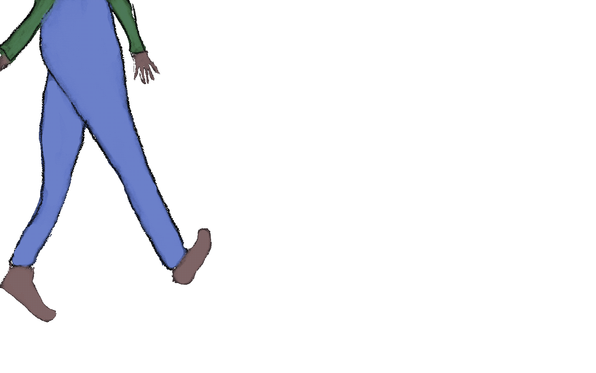
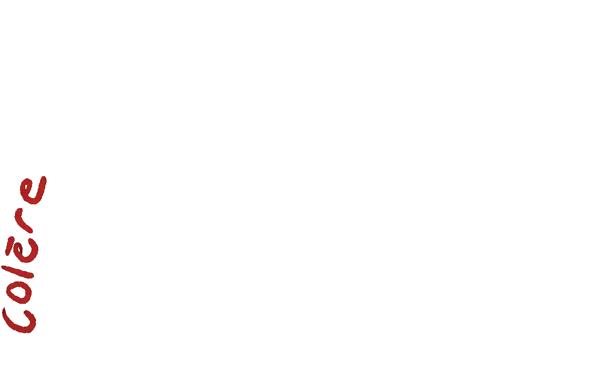
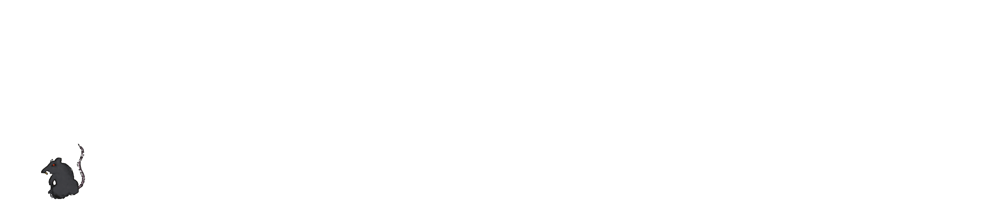

<!-- Titelbild -->

  

# Que trouvons-nous là-bas?
### Interaktive Medien – Scrollytelling (2025)

**Maria Reichmuth, Ricarda Schirato (MMP23CV)**

**Artefakt:** projektim05.mariareichmuth  
**Präsentationsvideo:** [Link einfügen]

---

## 1) Projektidee in einem Satz
Ein responsives Scrollytelling, bei dem der Scroll nicht nur Navigation ist, sondern das Erzählen selbst übernimmt: Zooms, Überblendungen, Perspektivwechsel und ein bewusster Richtungswechsel (vertikal → horizontal) sind direkt an die Scrollbewegung gekoppelt.

---

## 2) Fokus im Fach *Interaktive Medien*
Der Schwerpunkt dieses Projekts lag nicht auf klassischem Storytelling, sondern auf **Interaktionsdesign und technischer Umsetzung**.

Im Zentrum standen:
- Scroll als **dramaturgisches Werkzeug** (scrubbed Animation statt Autoplay)
- Ruhige, kontrollierte Übergänge ohne harte Schnitte
- Ein bewusster **Richtungswechsel** als Interaktionsmoment
- Stabilität und Performance bei komplexem Layering
- Responsives Verhalten und Umgang mit `prefers-reduced-motion`

---

## 3) Interaktionsablauf – Was passiert beim Scrollen?

### Kapitel 1: Vertikal (Hero – pinned)
Der Einstieg ist als *pinned section* umgesetzt. Der sichtbare Bildausschnitt bleibt fixiert, während der Scroll eine GSAP-Timeline scrubbt.

Dabei passieren unter anderem:
- langsamer **Zoom in den Gullideckel** durch Skalierung mehrerer Layer  
- **Layer-Wechsel** (Strasse → Detail → Kanalisation) über Crossfades  
- Ein- und Ausblenden von Texten als narrative Beats  
- **Schwarzblenden** als bewusste Übergänge zwischen Ebenen  
- Ein vertikaler Abstieg entlang einer Leiter, während ein Leitmotiv im Bild präsent bleibt  

  

---

### Kapitel 2: Horizontal (Kanal – pinned Track)
Nach dem Abstieg ändert sich die Bewegungslogik. Der Scroll wird horizontal interpretiert, obwohl weiterhin vertikal gescrollt wird.

- Ein horizontaler Track mit mehreren Slides wird seitlich verschoben (`xPercent`)
- Die Nutzer:innen „gehen“ scrollend durch den Kanal
- Der Richtungswechsel markiert bewusst einen neuen erzählerischen Abschnitt

  

---

## 4) Technische Umsetzung

### Stack
- **HTML / CSS / JavaScript** (statisch)
- **GSAP** (Animation)
- **GSAP ScrollTrigger** (Scroll-Steuerung, Pinning, MatchMedia)

Illustrationen und GIFs wurden mit **Procreate** und **Adobe Photoshop** erstellt.  
Die Programmierung wurde mit Unterstützung von **ChatGPT** umgesetzt.

---

### Zentrale technische Prinzipien

#### a) Scroll = Timeline
Alle Animationen laufen in GSAP-Timelines mit `scrub: true`.  
Die Scrollposition steuert direkt den Fortschritt der Animation.

#### b) Layering statt Szenenwechsel
- Mehrere übereinanderliegende SVGs, Overlays und GIFs  
- Sichtbarkeit wird über `opacity` / `autoAlpha` gesteuert  
- Keine harten Schnitte, sondern fliessende Übergänge  

  

#### c) Performance & Stabilität
- Preload + Decode zentraler Assets vor Start
- Anti-Flicker-Massnahmen (`translateZ(0)`, `backface-visibility`, `will-change`)
- Fokus auf GPU-freundliche Properties (`transform`, `opacity`)

#### d) Responsiveness
Unterschiedliche Positionierungen und Transform-Origins für Mobile und Desktop über `ScrollTrigger.matchMedia`.

#### e) Reduced Motion
- `prefers-reduced-motion: reduce` wird respektiert
- Optionaler Override über `?motion`
- Im Reduced-Motion-Modus werden finale Zustände gesetzt, statt die Timeline zu scrubben

---

## 5) Animierte Elemente – warum GIFs?
GIFs werden gezielt als **Mini-Events** eingesetzt. Sie verstärken Handlung und Atmosphäre, ohne die Szenen dauerhaft zu überladen.

- **schritte.gif** – Alltagsfluss an der Oberfläche  
- **zigarette.gif / Zigi2.gif** – Auslöser und Leitmotiv  
- **graffiti.gif** – visuelle Spuren unterdrückter Gedanken  
- **ratte.gif / ratte2.gif / ratte3.gif** – wiederkehrendes Motiv mit drei Zuständen  

  

**Technischer Kniff (Ratte 2):**  
Die zweite Ratte liegt als `fixed` Overlay über der Szene, reagiert auf die Scrollrichtung (Spiegelung/Position) und wird periodisch „seamless“ neu gestartet (Element ersetzen + Cache-Busting), um einen stabilen Loop zu gewährleisten.

---

## 6) Projektstruktur

Projekt-IM5/
├─ index.html
├─ style.css
├─ script.js
├─ README.md
└─ sketch/
├─ *.svg
├─ *.png
└─ *.gif

yaml
Code kopieren

Alle visuellen Assets sind im Ordner `sketch/` gebündelt und werden im Code über relative Pfade eingebunden.

---

## 7) Reflexion (Interaktive Medien)
Das Projekt hat gezeigt, dass Scrollen mehr sein kann als Navigation.  
Durch die direkte Kopplung von Scrollposition und Animation entsteht eine kontrollierte, ruhige Erzählform, bei der Nutzer:innen das Tempo selbst bestimmen.

Besonders lehrreich waren:
- das präzise Timing komplexer Timelines
- der Umgang mit Performance bei vielen Ebenen
- der bewusste Einsatz von Bewegung statt visueller Überreizung

Die technische Umsetzung versteht sich nicht als Selbstzweck, sondern als Mittel, um Interaktion erfahrbar zu machen.

---

*Projekt im Rahmen des Moduls **Interaktive Medien**, 2025.*
